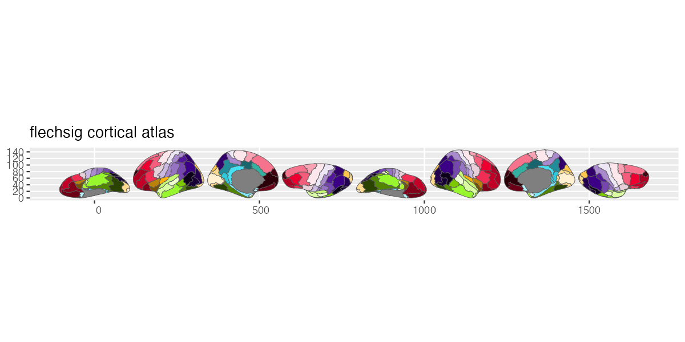

# ggsegFlechsig

<!-- badges: start -->
[](https://github.com/ggsegverse/ggsegFlechsig/actions/workflows/R-CMD-check.yaml)
[](https://ggsegverse.r-universe.dev/ggsegFlechsig)
<!-- badges: end -->

Flechsig Myelogenetic Atlas for the ggsegverse Ecosystem.

## Installation

``` r
# From r-universe
install.packages("ggsegFlechsig", repos = "https://ggsegverse.r-universe.dev")

# From GitHub
# install.packages("remotes")
remotes::install_github("ggsegverse/ggsegFlechsig")
```

## Usage

``` r
library(ggsegFlechsig)
library(ggseg)

plot(flechsig()) +
  theme_brain()
```

## Atlas

### flechsig

Flechsig 1920 myelogenetic cortical parcellation with 46 regions per hemisphere (Pijnenburg et al., 2021).


